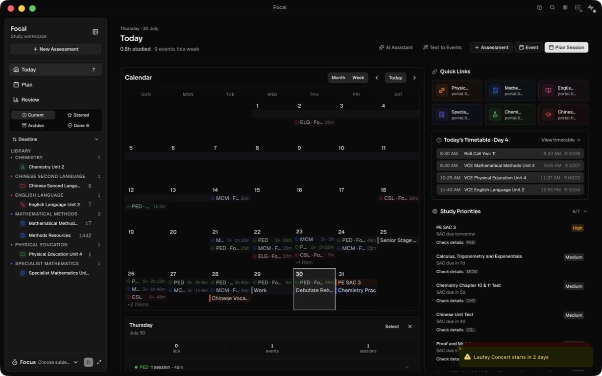
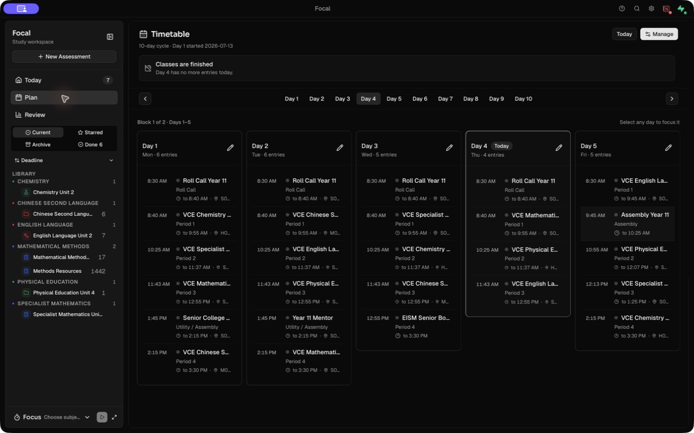
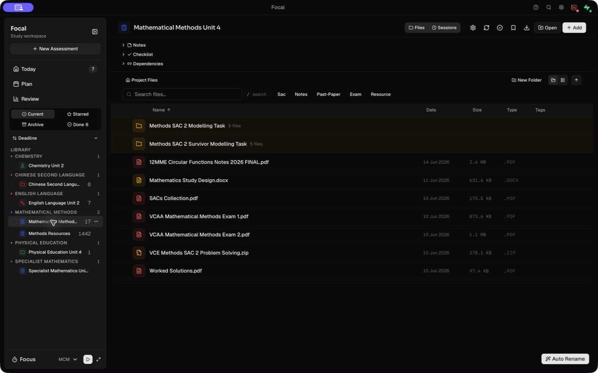
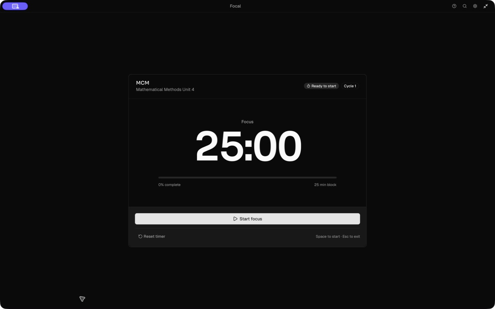
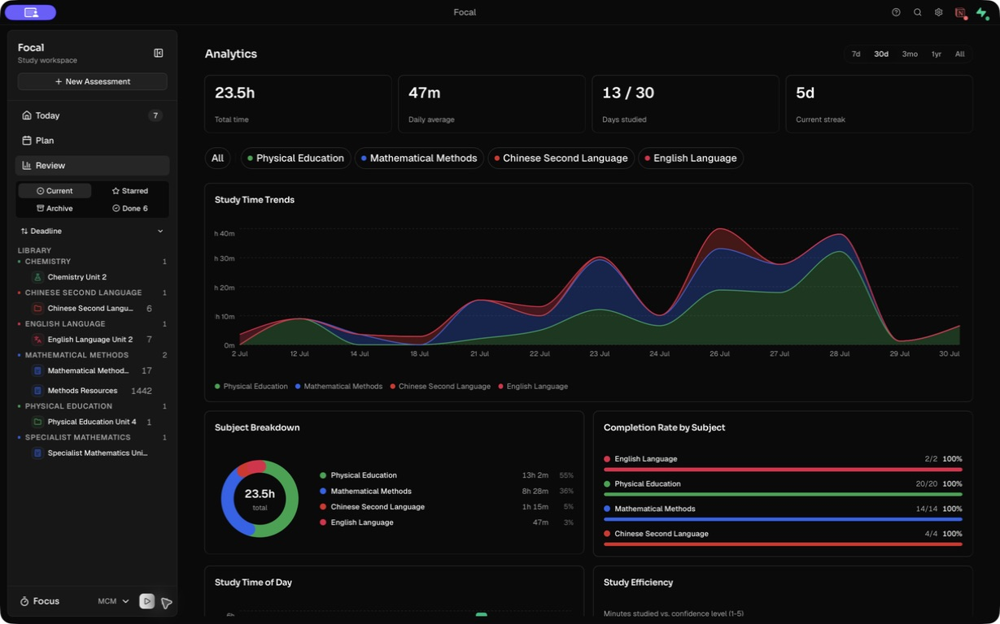
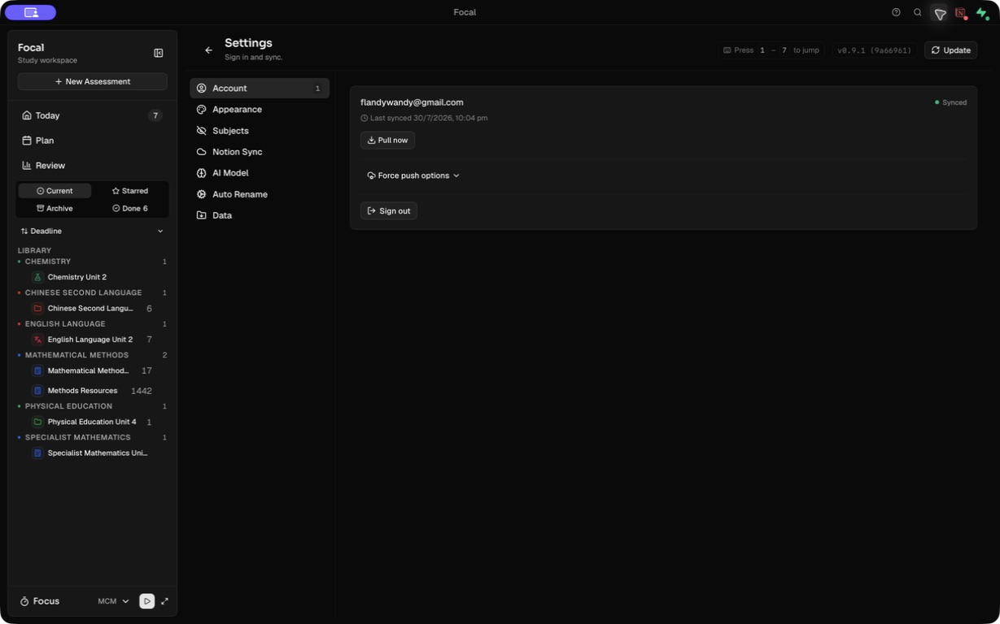
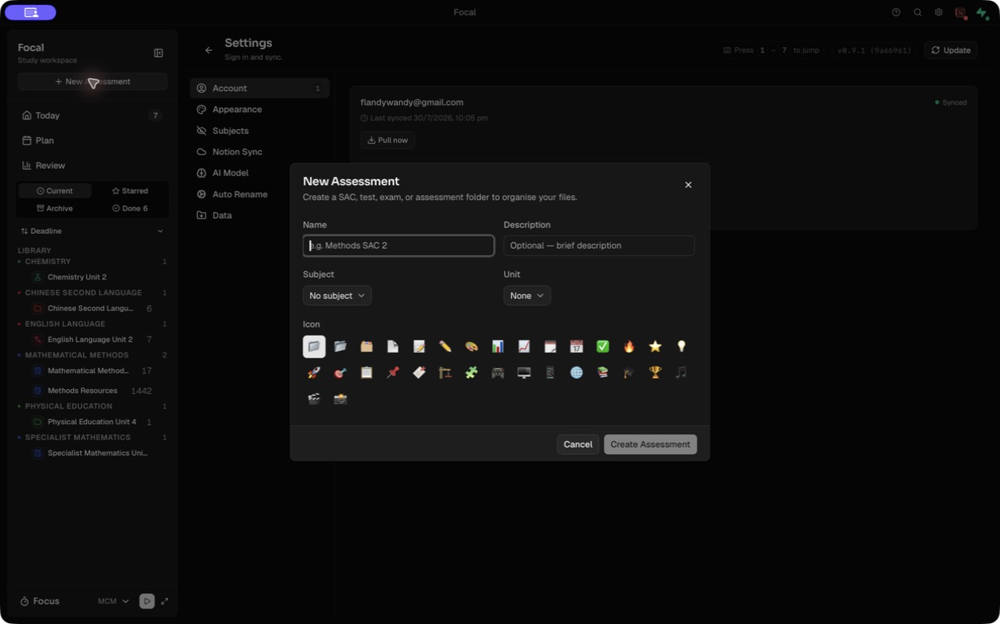

# Focal product audit — 30 July 2026

## Scope

Combined UX and screenshot-based accessibility audit of the native desktop app, using the current local data set. The reviewed loop was: orient in Today, inspect Plan, open an assessment, enter Focus, review analytics, inspect Settings, and create a new assessment.

User goal: quickly turn coursework and deadlines into a clear next study action, complete the work, and learn what to do next.

Accessibility target: the visible experience should support keyboard and pointer use, readable hierarchy, non-colour state cues, and practical zoom/reflow. Screenshots and the macOS accessibility tree cannot establish full WCAG conformance.

## Overall verdict

Focal already contains nearly every useful ingredient, but they are arranged as separate features instead of one closed study loop. Focus mode is the clearest expression of the intended product: restrained, obvious, and action-oriented. Today, Plan, assessment creation, and Review need to be rebuilt around `capture -> commit -> focus -> reflect`.

The largest structural issue is that an assessment is presented as a folder when created. The form omits its type and due date even though the data model and downstream prioritisation depend on both. Calendar events then carry similar assessment types separately. This prevents the rest of the app from having one trustworthy object for "what is due, what work remains, and when will I do it?"

## Captured flow

### 1. Today — at risk

Strength: the calendar, timetable, priorities, and quick links are all visible and useful on their own.

Risk: the page behaves like a dashboard, not a decision surface. The full month calendar dominates while the best next study block has no primary position. Five creation/AI actions compete in the header, and the right rail adds several more destinations. The user still has to synthesize the answer to "what should I do now?"

### 2. Plan — mixed

Strength: the timetable is legible, compact, and makes the current day clear.

Risk: the destination is labelled Plan but contains a timetable viewer. It has no workload backlog, capacity view, or interaction that turns an assessment next action into a scheduled study block. Timetable constraints and actual planning are separate mental models.

### 3. Assessment workspace — mixed

Strength: the file table is fast and appropriately desktop-native. Search, file types, tags, folders, and direct OS access are credible differentiators.

Risk: the assessment's purpose is visually secondary to file management. Due date, readiness, remaining work, next action, planned time, and the primary `Plan / Start` action are absent. Notes, checklist, dependencies, files, sessions, auto-rename, and eight toolbar actions form separate tools instead of one assessment workflow.

### 4. Focus — healthy

Strength: this is the best screen in Focal. It is calm, obvious, keyboard-friendly, and has a strong single action. The accessibility tree exposes a labelled dialog, progress bar, status, and controls.

Risk: it scopes work to a subject/project, not a concrete next action or finish condition. A student can log 25 minutes without declaring what will be completed, so the reflection and analytics have weak outcome context.

### 5. Review — mixed

Strength: chart craft is strong, date ranges and subject filters are clear, and charts expose textual summaries to assistive technology.

Risk: the screen reports activity rather than changing a decision. Time, streak, distribution, completion, and consistency do not answer which assessment is under-prepared, which blocker recurs, whether planned work happened, or what should be scheduled next. The most valuable existing signals—confidence, blockers, and next action—are not the organising frame.

### 6. Settings — mixed

Strength: sections are clearly named and sync state is understandable inside the Account pane.

Risk: the full study sidebar remains visible while Settings introduces a second navigation rail, leaving large unused space and unnecessary context. Notion and Supabase also surface as separate top-bar states across the app, which creates persistent attention cost when only actionable failures matter.

### 7. New assessment — at risk

Strength: the dialog is compact and the primary action remains disabled until a name is provided.

Risk: it asks for name, description, subject, unit, and one of many emoji, but not assessment type or due date. The current submit path explicitly passes no deadline. This is the most consequential gap because Today, sidebar ordering, reminders, prep balance, and AI prioritisation all depend on deadline data. The icon grid is decoration before the essential planning facts exist.

## Largest gaps, ranked

1. **No single assessment source of truth.** Assessment folders and calendar deadline-like events overlap, while creation omits due date/type. Fixing this unlocks reliable prioritisation everywhere else.
2. **Today does not make the next decision.** It shows comprehensive information but does not choose a clear `Now`, `Next`, and `At risk` hierarchy.
3. **Plan is a timetable, not a planning workspace.** There is no bridge from assessment backlog to available time.
4. **The work loop loses intent.** Focus records time against a subject/project, but not the task, expected result, or finish condition.
5. **Review is analytical rather than corrective.** It visualises effort without turning reflections and coverage gaps into next-week changes.
6. **Density and micro-controls fight the product brief.** Permanent library chrome, truncated labels, small metadata, icon-only actions, and colour-heavy subject encoding make the app feel busier than its `Sharp · Fast · Minimal` intent.

## Ground-up redesign

### Product loop

Build the app around four verbs:

1. **Capture** — create/import an assessment or resource once.
2. **Commit** — define the next action and place it into an available study block.
3. **Focus** — work on that action with the timer and lightweight notes.
4. **Reflect** — record confidence/blocker/next action, then feed it back into Today and Plan.

### Core model

- `Assessment`: subject, type, due date/time, status, optional weighting, readiness, files, checklist, dependencies.
- `Action`: one finishable unit of work linked to an assessment; can be backlog, planned, active, or done.
- `Study block`: planned time plus actual intervals and reflection, linked to an action.
- `Event`: non-assessment calendar item. Assessments appear on the calendar automatically rather than being recreated as events.
- `Resource`: a file or link associated with a subject/assessment; unassigned drops land in an inbox.

### Information architecture

- **Today** — Now, today's timeline, at-risk assessments, and inbox.
- **Plan** — week calendar plus action backlog; timetable is the constraint layer behind available time.
- **Library** — subjects, assessments, and resources; the long project list moves out of the global shell.
- **Review** — weekly decisions and readiness changes; detailed charts are secondary.
- **Focus** — a contextual mode launched from a chosen action, not a global subject timer.

Settings, search, sync, and integrations remain utilities rather than primary navigation.

### Key screens

**Today**

- One dominant `Start next block` card with task, assessment, duration, and a short reason.
- A compact chronological day timeline for classes, study blocks, and events.
- At most three at-risk assessments, using due date + planned coverage + confidence.
- A small inbox for unassigned files or unscheduled next actions.
- Move the month calendar, quick links, month brief, and aggregate analytics elsewhere.

**Plan**

- Week view with school timetable shown as fixed constraints.
- An unscheduled action backlog beside the calendar.
- Drag or one-click schedule actions into realistic free windows.
- Show remaining workload versus available capacity before each deadline.

**Assessment**

- Header: type, due date, readiness, remaining work, planned coverage.
- Primary actions: `Plan next block` and `Start focus`.
- Checklist/next actions visible before files; files remain a strong secondary workspace.
- Sessions and reflections form one activity timeline instead of a separate mode.
- Keep advanced file actions in a menu until they are needed.

**Focus**

- Require or suggest a concrete action: `What will be done when this block ends?`
- Keep the existing visual restraint.
- Allow one-line scratch notes without exposing the rest of the app.
- Finish with confidence, blocker, and next action; schedule the next action immediately when useful.

**Review**

- Lead with `planned vs completed`, assessment readiness changes, low-confidence topics, repeated blockers, and uncovered deadlines.
- End with a short review queue: confirm or schedule the next actions.
- Keep detailed time charts under an expandable `Trends` section.

### Creation and setup

The new-assessment happy path should ask only for `name`, `subject`, `type`, and `due date`. Derive the icon from subject/type and create the folder and calendar presence automatically. Move unit, description, templates, custom folders, and linking/import into progressive disclosure.

For first run, use a short setup: choose subjects, select/link a coursework folder, optionally add the timetable, then create the first assessment. Account, Notion, AI, and appearance can wait until the relevant feature is used.

## Accessibility risks and limits

- The screenshots show many 11–13 px metadata labels and low-emphasis grey text. These need contrast measurement at every theme/zoom combination.
- Calendar cells, emoji choices, top-bar icons, and several project toolbar controls appear small and dense. Confirm target size, focus visibility, and activation at 200% zoom.
- Calendar and analytics rely heavily on subject colour and abbreviated labels. Preserve text/state labels and never make colour the only discriminator.
- Truncation is frequent in the sidebar, timetable, and calendar. Tooltips do not replace an accessible full name or resilient reflow.
- The accessibility tree is a real strength: major controls are labelled, focus mode is a dialog, and chart summaries exist. Full keyboard order, screen-reader announcements, error recovery, contrast ratios, and zoom/reflow still require dedicated testing.

## Recommended delivery order

1. Unify assessment creation, type, due date, and calendar representation.
2. Replace Today with `Now / Today / At risk` and one primary next action.
3. Build action backlog + weekly planning on top of the timetable.
4. Link Focus to an action and feed reflection into the next action.
5. Reframe Review around readiness and corrective decisions.
6. Collapse global chrome and run the dedicated accessibility pass.

