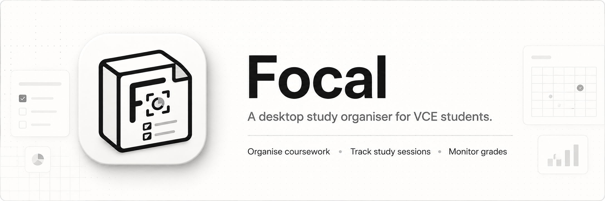

<div align="center">



# Focal

**A fast, minimal desktop study organiser for VCE students.**

Manage coursework files, plan sessions around a configurable timetable, and track progress across subjects — all from a native desktop app.

[](https://github.com/flandolf/focal/releases)
[](https://github.com/flandolf/focal/actions)
[](https://github.com/flandolf/focal/releases)
[](https://github.com/flandolf/focal)

</div>

---

## Features

### Organize

- **Project management** — group coursework by subject, unit (1–4), and deadline type (`SAC`, `Exam`, `Assignment`). Each project owns a folder on disk with the subject's default subfolders (SACs / Notes / Past-Papers / Exam-Revision / Resources).
- **Project templates** — save assessment scaffolds with custom icons, subfolders, and checklists to spin up new projects in a click.
- **File organisation** — drag-and-drop into project folders (or paste `file://` URLs), bulk tag, rename, move between subfolders, copy paths, undo toast.
- **Checklists & dependencies** track subtasks per assessment and surface what blocks what in Today.

### Plan

- **Timetable** — configurable cycle length (default 10-day VCE rotation), per-day period editing with subjects / locations / breaks, school holidays, weekend support, manual day override.
- **Calendar** — month / week grid, multi-day events, drag-to-reschedule, batch select / complete / merge / delete, study priorities, prep balance, month brief.
- **Deadline notifications** — in-app toasts plus optional native OS notifications at *due now*, *today*, *tomorrow*, and *soon* (≤72 hours).
- **Text to Events** — paste a teacher notice or rough plan; the AI extracts draft calendar events you can review and approve.

### Focus

- **Customisable Pomodoro** — work / break / long-break durations, full-screen Focus view, recovery dialog on reopen, overtime study mode, post-session reflection (confidence 1–5, blockers, next-action).
- **AI Auto Rename** proposes consistent, descriptive filenames for dumped files (optionally using file-content snippets as context).
- **Analytics** — total time, daily average, streak, study-time trend, subject breakdown, completion rate, efficiency, time-of-day, and consistency heatmap across 7d / 30d / 3mo / 1yr / All.
- **Global search** (⌘K / Ctrl K) and a dense keyboard-shortcut layer everywhere.

### Sync

- **Supabase multi-device sync** — optional account-driven sync with conflict handling, push / pull, retry, and realtime updates.
- **Notion sync** — optional two-way sync with a Notion database for events and sessions.
- **Data export** — portable JSON backup of projects, sessions, events, templates, and settings.

---

## Tech Stack

| Layer | Tools |
| --- | --- |
| Frontend | React 19 · TypeScript (strict) · Tailwind v4 · Radix primitives · Recharts · Framer Motion · Sonner · `lucide-react` · `react-day-picker` · `date-fns` |
| Desktop shell | Tauri v2 (Rust) — plugins: `fs` (with watcher) · `dialog` · `notification` · `opener` · `shell` · `os` · `updater` |
| Type & colour | Sora Variable (display) · Geist (UI) · single-accent palette, dark and light modes equally considered |
| AI | OpenRouter or local Ollama, with structured output and tool calling (Auto Rename, Text-to-Events) |
| Cloud | Optional Supabase Auth + Postgres + Realtime, custom sync engine (queue, conflict resolution, device tracking). Notion integrates separately. |

---

## Development

```bash
bun install
bun run dev          # Vite dev server on port 1420
bun run tauri dev    # Full Tauri desktop app in dev mode
```

```bash
bun run typecheck    # tsc --noEmit
bun run lint         # ESLint
bun run lint:fix     # ESLint auto-fix
```

Self-checks live in `scripts/` (`check-timetable-reorder.ts`, `sync-self-check.ts`). Adding a new AI provider is documented in [`PROVIDERS.md`](./PROVIDERS.md).

---

## Keyboard Shortcuts

| Shortcut | Action |
| --- | --- |
| ⌘K / Ctrl K | Global search |
| ⌘N / Ctrl N | New assessment |
| ⌘⇧N | New calendar event |
| ⌘⇧S | New study session |
| ⌘+ / ⌘− / ⌘0 | Zoom in / out / reset |
| H | Go to Home (Today) |
| T | Go to Timetable |
| A | Go to Analytics |
| `[` | Toggle sidebar (outside input fields) |
| 1–7 | Jump to Settings sections |

Single-key shortcuts (H / T / A / `[` / `/`) fire only when no input has focus.

---

## Supabase Sync Setup

Focal works locally without signing in. To enable multi-device sync:

1. Create a Supabase project.
2. Run `supabase/migrations/0001_initial_sync.sql` in the Supabase SQL editor (or via the Supabase CLI).
3. Copy `.env.example` to `.env` and set `VITE_SUPABASE_URL` and `VITE_SUPABASE_PUBLISHABLE_KEY`.
4. Confirm the sync tables are in the `supabase_realtime` publication (the migration includes the `alter publication … add table …` statements).
5. Run `bun run dev` or `bun run tauri dev`, then sign in from Settings → Account.

Do not put a Supabase service-role or secret key in `.env` — the desktop client only uses the publishable key. Notion is a separate, optional calendar integration; enable it from Settings → Notion Sync after creating an integration token.

---

## Production Build

```bash
bun run build     # tsc + Vite production build
make build        # Lint-fix, version bump, Tauri compile, install to /Applications (macOS)
```

`make` targets: `dev` · `tauri-dev` · `build` · `build-only` · `install` · `lint` · `lint-fix` · `typecheck` · `check` · `clean` · `distclean` · `format` · `bump-version` · `release` · `release-dry-run`. CI ships native bundles for macOS (arm64 + x86_64), Linux, and Windows via the `publish` workflow on push to `main`; built `.app` lands in `src-tauri/target/release/bundle/macos/`.

The release workflow also signs updater artifacts and uploads `latest.json` for Tauri's updater. Keep `TAURI_SIGNING_PRIVATE_KEY` set in GitHub Actions secrets; published GitHub releases are what installed apps check for updates.

---

## Assessment Types

VCE ships three: `sac`, `exam`, `assignment`. Calendar events extend with `homework`, `event`, `other`, and `practice-sac`. Add a new deadline type in `src/lib/types.ts` if your school needs one (e.g. `GAT`).
